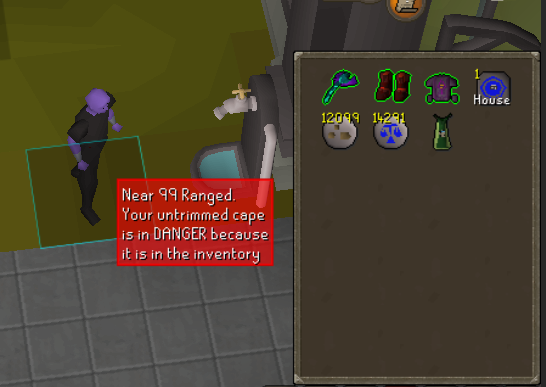
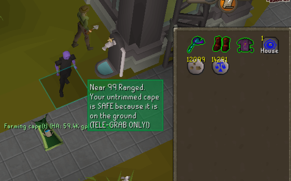
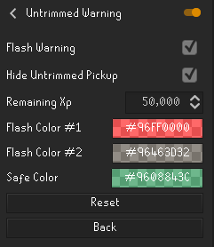

# Runelite Untrimmed Warning Plugin

### Features

* Overlay popup when getting close to a new 99 to remind player to hide their untrimmed cape.

* Overlay describes where the cape is located and whether that spot is safe or not according to the wiki.

* Hide left click pickup for untrimmed cape to avoid auto-trim on pickup.

### Configuration

The OSRS wiki has [*details*](https://oldschool.runescape.wiki/w/Cape_of_Accomplishment#Keeping_the_first_Skillcape_untrimmed) on how to keep untrimmed skill cape safe.

**DISCLAIMER**: This plugin is NOT bulletproof. Developer(s) are not responsible for losing untrimmed cape due to any faulty information on the wiki or any bugs in the plugin.
